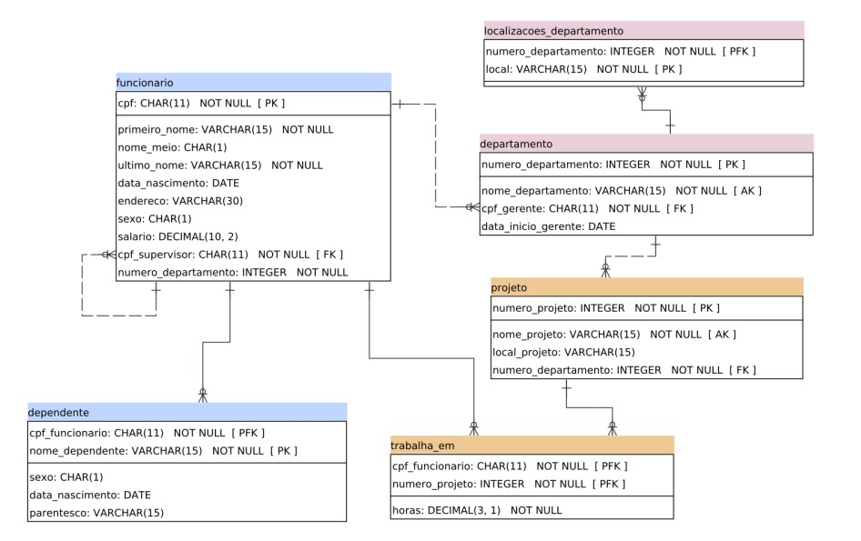
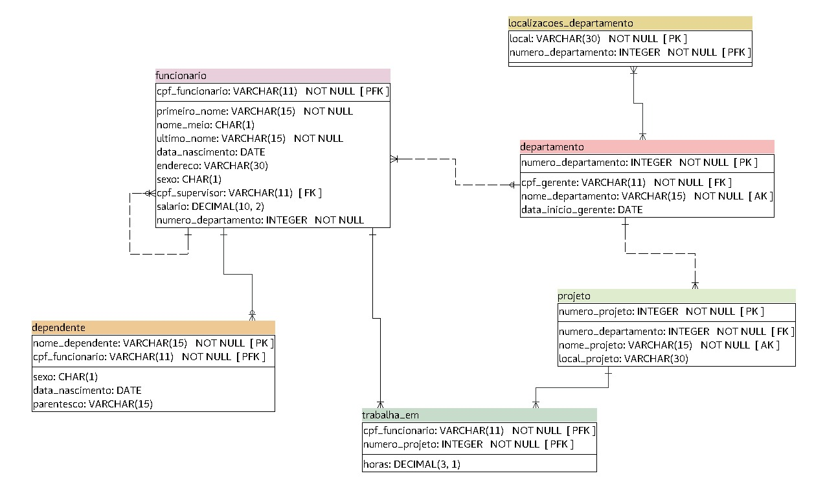

># ***Projeto De Design e Desenvolvimento de Bancos de Dados*** Prof. Abrantes Araújo Silva Filho 
## Explicação da correção dos erros no projeto Elmasri fornecido pelo PDF disponibilizado pelo professor
---
### Erros:
1. local:VARCHAR(15)
2. Relacionamento funcionario-departamento = N:1
3. cpf_supervisor NOT NULL
4. Relacionamento localizações_departamento = N:1
5. hora NOT NULL

---

### Correções:
1. local:VARCHAR(30) Porque os endereços dados pelo pset tem tamanho maior que 15 caracteres.
2. Relacionamento funcionario-departamento = 1:N
3. cpr_supervisor pode ser NULL, por que nos dados da coluna cpf_supervisor do pset uma tupla está com NULL. 
4. Relacionamento localizações_departamento = N:N
5. hora pode ser NULL

    *Correções extras*
    - Tipo cpf_funcionario de char para varchar

